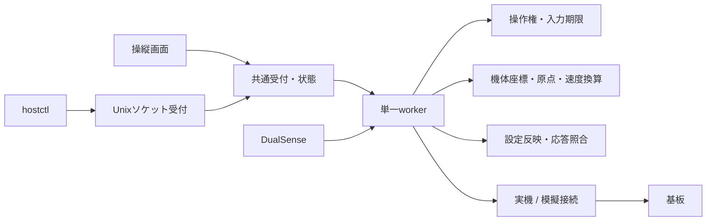
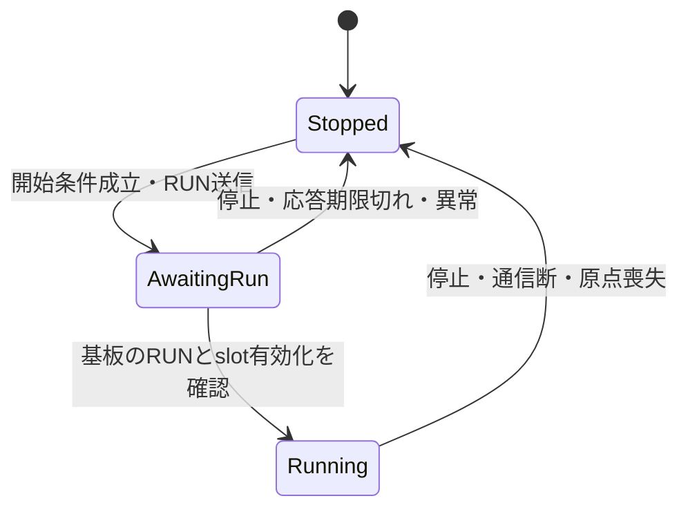

# hostのアーキテクチャ

hostは機体座標・入力割当・操作権・設定反映を管理する。各基板のFWは、デバイスの制御、
基板単位の絶対制限、SAFE/STOP、通信監視を担当する。機体固有の動作をFWへ持ち込まず、
hostの機体モデルと実行管理に追加する。

## プロジェクト境界

| プロジェクト | 責務 |
| --- | --- |
| `host/` | 機体設定、原点、手動速度操作、操縦画面、ローカル操作API |
| `cctl/` | 汎用slotのモータ制御、USB指令受付、CANゲートウェイ |
| `dcmd/` | DCモータ出力、エンコーダ、基板内の制限と通信監視 |
| `serial_svmd/` | STS3215の通信・出力管理、シリアル/CAN指令受付 |
| `svmd/` | PWMサーボ出力、CAN指令受付 |
| `tests/` | ハードウェアに依存しないFWのロジック検証 |

FWの`domain/`は指令解釈・制御計算・状態管理を担い、`app.cpp`や`main.cpp`が
周辺回路との接続を担う。詳細は[汎用FWの設計](generic_firmware.md)を参照。

## Rustのモジュール境界

`host/src/lib.rs`が共通実装を公開する。`main.rs`、`bin/hostctl.rs`、`bin/fw_test.rs`は
それを利用する実行入口で、ソースファイルの直接取り込みによる実装共有は行わない。

| モジュール | 責務・主な入口 |
| --- | --- |
| [machine](../host/src/machine/mod.rs) | `profile.rs`: 設定形式・検証、`controller.rs`: 原点・接点観測と速度換算、`dc_motor.rs`: DCモータの入力割当 |
| [application](../host/src/application/mod.rs) | `command.rs`: 要求・応答、`app_state.rs`: 受付・表示用状態、`authority.rs`: 操作権と入力期限、`settings.rs`: 設定反映、`worker/`: 実行順序と状態遷移 |
| [protocol](../host/src/protocol/mod.rs) | 基板種別、指令の符号化、状態・設定応答の解釈 |
| [transport](../host/src/transport/mod.rs) | USBシリアル、模擬接続、プロファイルの読込・保存 |
| [input](../host/src/input/mod.rs) | 入力スナップショットとDualSenseの読み取り |
| [interface](../host/src/interface/mod.rs) | Unixソケットの接続受付、長さ付きTOMLの送受信 |
| [gui](../host/src/gui/mod.rs) | 画面共通状態と遷移。操縦・調整・診断・文書は各画面のモジュールで描画。`manual.rs`は画面ジョグ、`parameter_help.rs`は調整値の説明、`documents.rs`はMarkdown表示を担当。`individual.rs`は個別テスト画面、`controls.rs`は全ページ共通の状態・緊停・コマンド入力を担当。`shortcuts.rs`のコマンド一覧に名前・説明・操作を登録し、Vim系の画面移動を含むキーを解釈し、ボタンと共通の操作入口へ渡す |
| [diagnostics](../host/src/diagnostics/mod.rs) | 通常hostとは独立して使うFW保守セッションと接続準備 |

機体モデルはGUI、ソケット、ファイルシステムを参照しない。基板プロトコルは機体モデルや
保守セッションを参照しない。要求の型はapplicationが所有し、GUIとソケット受付が利用する。
通信方式を変更しても、操作権や原点管理の実装を複製しない。

## 実行時の所有関係

単一のworkerが機体接続、機体モデル、操作権、設定反映、運転状態を所有する。
GUIとAPIは`Shared`へ要求を送り、表示用の状態を読み取る。機体への書き込みはworkerに集約する。
ゲームパッドもworker内で読み取り、同じ開始条件・停止処理・速度指令生成を使う。



`fw_test`は独立した保守用プロセスとして接続を所有するため、通常hostと同じポートを
同時に開かない。手順は[FW動作確認](firmware_tests.md)を参照。

## 状態と安全条件

hostの運転状態は`Stopped`、`AwaitingRun`、`Running`のいずれかで表す。
要求が受理されても、基板のRUN状態と対象slotの有効化が確認されるまでは運転中にしない。
RUN反映の待機中には速度指令を送らない。



- 開始時に接続鮮度、基板能力、設定の反映、原点、入力中立を確認する。
- 通常停止は速度ゼロによる保持、出力停止はFWのSTOPとして区別する。
- 操作権は運転状態とは別に管理する。AIの操作権は30秒、各軸の入力は150msで期限切れになる。
  heartbeatは操作権だけを延長し、スティック入力の期限を延長しない。
- 停止要求は操作権に関係なく受け付ける。AIの解放・期限切れで通常操縦を自動再開しない。
- `observe`は実測値と接点から原点状態を更新する。`jog_lines`は入力から速度指令を生成し、
  host側に移動目標を積み上げない。

## 設定の流れ

`profile_store::load`でファイルを読み、`MachineProfile::parse`で検証する。
`MachineProfile::embedded`は同梱設定を使う入口で、通常起動はディスク上のファイルを読む。

一時適用と保存は別要求である。一時適用は機体モデルと設定送信計画を作り直し、
原点を無効化する。保存は同一ディレクトリの一時ファイルへの書き込み完了後に置き換える。

`Settings`は基板種別・パラメータID・値を保持し、一件ずつ送って適用値の応答を待つ。
送信文字列から宛先を逆算しない。別基板の同じID、汎用の`OK`、送信前に届いた応答では
反映済みにしない。不一致や応答期限切れは運転開始を妨げる。

## 機能追加の配置

EEやボーナスの機体固有の動作は`machine/`に、開始条件・中断・実行順序は
`application/`に追加する。新しい操作要求は`command.rs`とworkerの要求処理に定義し、
GUIとAPIで同じ入口を使う。画面にCANフレームの生成や操作権判定を実装しない。

基板の指令追加は`protocol/`と対応FWで扱う。模擬応答は`transport/simulator.rs`に置き、
実機と同じworkerの経路で検証する。現在の通常操縦経路が生成する駆動指令はrθzのJOGであり、
周辺サーボのプロファイル定義だけで駆動を開始しない。

## 検証

リポジトリルートで実行する。

```sh
cargo fmt --manifest-path host/Cargo.toml -- --check
cargo test --locked --offline --manifest-path host/Cargo.toml
cargo clippy --locked --offline --manifest-path host/Cargo.toml --all-targets -- -D warnings
cargo build --locked --offline --manifest-path host/Cargo.toml --bins
```

単体テストは原点・リミット・速度換算、操作権と入力期限、基板ごとの応答照合、保守ツールを検証する。
`host/tests/simulated_host.rs`は実行ファイルを起動し、実際のソケットで操作権・停止復帰・
一時適用と保存を検証する。模擬接続は衝突や実際の制動距離を再現しないため、機構の動作確認は
[立ち上げ手順](bringup.md)に従って実機で行う。

## 緊停と個別テスト

`Shared`は緊停要求を優先受付し、未実行要求を取り消す。原子的な通知フラグをワーカーが
コントローラ入力の処理前と要求実行の間で確認する。ワーカーの緊停状態はAIの操作権を破棄し、
通常運転・個別テスト出力・操作権再取得を禁止する。解除要求はGUIからのみ受け付け、出力停止を維持する。

`worker/test_control.rs`が個別テストの選択対象・出力・入力期限・基板応答を管理する。
`diagnostics/individual.rs`は対象と方式の検証、指令値の範囲、既存プロトコルによる指令生成を担当する。
通信は通常操縦と同じワーカーの`Link`を使用する。ページ遷移は出力状態を所有せず、位置保持を取り消さない。
速度・DC出力はGUIの押下更新が150ms途切れるとワーカーが解除する。
